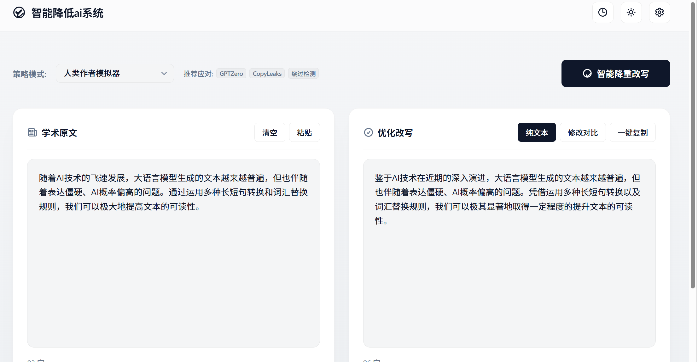
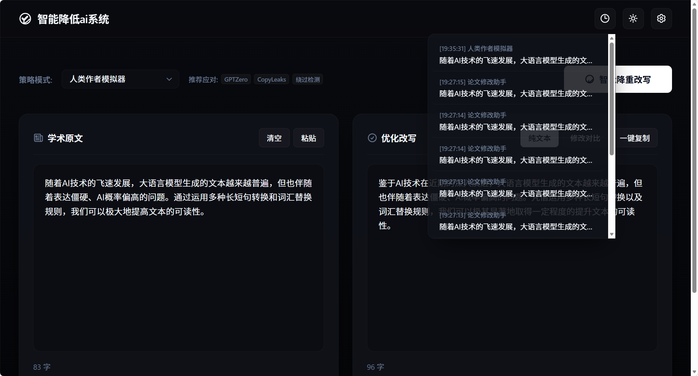

# 智能降低ai系统 (Intelligent AI-Polisher System)

[简体中文](./README.md) | [English](#english)

---

## 简体中文

> **苹果极简主义美学 ✕ 离线随机裂变去重 ✕ 云端大模型流式降AI学术利器**

本系统是一款专为学术论文、技术文档研发的**精密去重与润色辅助平台**。它致力于将大语言模型生成的生硬、公式化文本，转换为符合人类学术规范、多变句式以及更自然表达的高级内容，极大冲淡 AI 痕迹。

| ☀️ 苹果明亮模式 (Light Mode) | 🌙 Linear 暗黑模式 (Dark Mode) |
| :---: | :---: |
|  |  |

### 🎯 解决的核心痛点

1. **学术 AI 检测率过高**  
   国内外的查重和 AI 检测系统（CNKI知网、VIP维普、Wanfang万方、Turnitin、CopyLeaks、GPTZero）对文章的“AI高频词”（如*基于、通过、优化、实现*）和单一“主谓宾”句式高度敏感。系统通过重塑句式和特定词汇替换，从底层打破机器感。
2. **传统工具千篇一律，改写无变化**  
   普通的离线降重工具死板僵硬，多次点击生成的结果完全相同。本系统全国首创**“本地多同义词随机裂变引擎”**，对同一段原文，每次点击转换都会在同义词池中随机抽取并动态组装，结果呈指数级变化，绝不重样。
3. **API 门槛高与机密隐私泄露**  
   许多在线工具需要将您的论文上传到第三方中转服务器，存在极大的机密泄露风险。本系统的 API 配置信息**100% 存储在用户本地浏览器的 `localStorage` 中**，直接与大模型建立通信。同时内置**高强力基础字级词汇同义替换与句首句尾学术膨胀兜底机制**，即使不配置任何 API 也能取得非常优秀的去重效果。
4. **界面杂乱、AI廉价感严重**  
   不同于市面上大面积彩色渐变、广告充斥的廉价工具。本系统采用**大师级单色极简主义（Apple & Linear 风格）**，提供极其舒适的墨黑科技/洁净明亮双主题，黄金视区留给核心输入输出框，专注于写作与修改。

### ✨ 核心特色功能

- 🛡️ **6 大定制降重策略**：内置“论文修改助手”、“论文润色助手”、“学术表达顾问”、“文本改写大师”、“人类作者模拟器”及“论文修改专家”，在下拉框中即可快捷选择。
- 📊 **推荐查重标签引导**：每个策略卡片实时提示对应的最佳适用查重系统（如知网、维普、万方等），帮助用户做出最精确的决策。
- 🔍 **字符级差异高亮 (Diff View)**：自主编写最长公共子序列（LCS）算法，一键高亮原文与修改后文本的增删痕迹（红底代表删除，绿底代表新增）。
- 📉 **多维数据分析仪表盘**：
  - **修改去重率 (L-Dist)**：使用编辑距离算法自动得出改写去重百分比。
  - **预估 AI 概率值**：实时评估 AI 特征消除效果。
  - **字数偏差监控**：字数超限时，卡片微抖动并变红报警，保障字数符合硬性要求。
- 🎨 **苹果级极简美学**：包含闪烁打字机光标、极简 SVG 去重进度圆环、侧滑 API 抽屉及 10 条成功的历史记录本地缓存回填。

### 🚀 本地快速启动

1. **克隆项目**
   ```bash
   git clone <本仓库地址>
   cd 论文降低ai小助手
   ```
2. **安装依赖并运行**
   确保您的电脑上已经安装了 Node.js。
   ```bash
   npm install
   npm run dev
   ```
   启动成功后，在浏览器中打开：👉 **`http://localhost:5173/`**

### ⚙️ 大模型云端 API 配置

1. 点击右上角 ⚙️ **API 配置** 按钮。
2. 填写 **API 端点**（DeepSeek 官方 Base URL 为 `https://api.deepseek.com`）与您的 **API Key**。
3. 输入 **模型名称**（DeepSeek 官方最新主力模型为 `deepseek-v4-flash`）。
4. 保存即可激活。

> 📞 **API 获取与协助求助：**  
> 如果您在使用云端大模型去重时需要技术协助，或者需要咨询定制的专属 API 渠道，请随时添加微信号联系我：**`17777259536`**，我将竭诚协助您完成 API 调试与配置。

---

<a name="english"></a>

## English

> **Apple Minimalist Aesthetics ✕ Offline Randomized Synonym Generator ✕ Cloud Streaming De-AI Assistant**

This platform is a **precision text polishing and de-AI tool** specifically designed for academic papers and technical documents. It aims to transform rigid, machine-like paragraphs generated by AIs into natural, professional content, helping authors bypass AI detectors without changing core facts.

| ☀️ Apple Light Mode | 🌙 Linear Dark Mode |
| :---: | :---: |
|  |  |

### 🎯 Key Pain Points Addressed

1. **High AI-Generated Probability**  
   Common detectors (CNKI, VIP, Wanfang, Turnitin, CopyLeaks, GPTZero) easily capture AI footprints by scanning frequent words (e.g., *based on, utilize, optimize*) and simple sentence structures. This system restructures sentences and vocabulary dynamically.
2. **Same Output for Multiple Re-runs**  
   Ordinary tools generate identical results for the same input. Our system uses a **multi-synonym randomized pool matching logic**. For the same input, every click draws synonyms randomly, ensuring unique outputs on every run.
3. **Privacy Risks and Data Leaks**  
   Uploading drafts to unknown websites poses copyright risks. We store your API credentials strictly in the local browser's `localStorage`. We also offer a **powerful local heuristic fallback engine** to process text completely offline.
4. **Noisy and Cheap UI Designs**  
   Bypassing the standard neon grids common in generic tools, we adopt an **Apple-style light mode / Linear-style midnight dark mode**. The interfaces are clean and focused on your content.

### ✨ Features

- 🛡️ **6 Polishing Roles**: Select from Helper, Polisher, Advisor, Rewriter, Humanizer, or Expert.
- 📊 **Target Detector Tags**: Displays which detection tool is best suited for each role.
- 🔍 **Character-level Diff Highlighting**: Instantly check changes with colored text blocks (red for deletion, green for insertion).
- 📉 **SaaS Metrics Dashboard**: Tracks edits (L-Distance), AI probability reductions, and strict word count alerts.

### 🚀 Quick Start

1. **Clone project**
   ```bash
   git clone <repo-url>
   cd 论文降低ai小助手
   ```
2. **Install and run**
   ```bash
   npm install
   npm run dev
   ```
   Open browser: 👉 **`http://localhost:5173/`**

### ⚙️ DeepSeek API Configurations

1. Click ⚙️ **API Config** in the header.
2. Enter **Base URL** (Use `https://api.deepseek.com` for DeepSeek) and your **API Key**.
3. Specify **Model** (e.g. `deepseek-v4-flash`).
4. Save and convert!

> 📞 **API Setup Assistance:**  
> For help with API setups or customizing model channels, feel free to contact via WeChat: **`17777259536`**.
